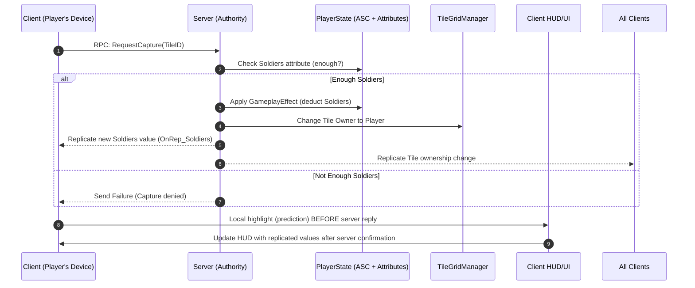

Rules of Thumb

If it changes game rules/outcome (resources, territory, alliances) → replicate (server-authoritative).

If it’s just presentation (UI, effects, camera) → don’t replicate.

If it’s input (tap, menu choice) → client → server RPC (then server replicates result).

For Pocket Front specifically:

Replicate: PlayerState attributes, Tile ownership/defense/structures, alliances, match phase/timer.

Don’t replicate: HUD, VFX, FTUE, camera.

Client–server model: lock to server-authoritative now. Clients only send “intents,” never apply game logic themselves.



Flow explained:

Client taps tile → sends an RPC RequestCapture(TileID) to server.

Server checks the PlayerState’s ASC/Attributes for available Soldiers.

If valid:

Deduct Soldiers via a GameplayEffect.

Update TileGridManager’s ownership.

Replicate both back: Attributes → PlayerState OnRep; Tile ownership → TileGridManager replication.

If invalid: server rejects → client can show “not enough soldiers.”

Client may predict locally (e.g., highlight tile) but final authority always comes from server replication.

Great — let’s focus purely on the **Authoritative Server Model** and what *replication* means in practice in Unreal.

---

# 1. Two kinds of replication

### a) **Property Replication**

* A **variable’s value** gets copied from **Server → Clients** automatically.
* Example:

  ```cpp
  UPROPERTY(ReplicatedUsing = OnRep_Soldiers)
  int32 Soldiers;
  ```
* On the server: you update `Soldiers`.
* Unreal automatically ships the new value to clients.
* On clients: `OnRep_Soldiers()` runs so you can update HUD, etc.

---

### b) **Function Replication (RPCs)**

* A **function call** is sent across the network.
* You declare where it runs:

    * `Server` (client → server)
    * `Client` (server → one client)
    * `NetMulticast` (server → all clients)
* Example:

  ```cpp
  UFUNCTION(Server, Reliable)
  void ServerRequestCapture(int32 TileID);

  UFUNCTION(NetMulticast, Reliable)
  void MulticastPlayCaptureEffect(int32 TileID);
  ```
* Clients call `ServerRequestCapture()`.
* Server runs it, validates, updates state.
* Then server may call `MulticastPlayCaptureEffect()` so everyone sees VFX.

---

# 2. Authoritative Server Model Workflow

1. **Client Intent** → RPC (e.g. “I want to capture Tile 10”).

   ```cpp
   void AMyController::TryCaptureTile(int32 TileID)
   {
       ServerRequestCapture(TileID);
   }
   ```

2. **Server Validates + Applies Changes**

    * Server checks attributes/resources.
    * Updates `Soldiers` (property).
    * Updates `Tile.Owner` (property).

3. **Replication Kicks In**

    * Server’s property changes replicate to all clients.
    * Any `OnRep` callbacks fire on clients to update UI.

4. **Optional Multicast for Cosmetics**

    * Server calls `MulticastPlayCaptureEffect()` so all clients spawn VFX.

---

# 3. Setting up replication (boilerplate)

### a) Tell Unreal your class replicates

In the class header:

```cpp
UCLASS()
class AMyPlayerState : public APlayerState
{
    GENERATED_BODY()
public:
    AMyPlayerState();

    UPROPERTY(ReplicatedUsing = OnRep_Soldiers)
    int32 Soldiers;

    UFUNCTION()
    void OnRep_Soldiers();

    virtual void GetLifetimeReplicatedProps(TArray<FLifetimeProperty>& OutLifetimeProps) const override;
};
```

### b) Implement replication list

```cpp
void AMyPlayerState::GetLifetimeReplicatedProps(TArray<FLifetimeProperty>& OutLifetimeProps) const
{
    Super::GetLifetimeReplicatedProps(OutLifetimeProps);
    DOREPLIFETIME(AMyPlayerState, Soldiers);
}
```

### c) OnRep callback (client-only reaction)

```cpp
void AMyPlayerState::OnRep_Soldiers()
{
    UE_LOG(LogTemp, Log, TEXT("Soldiers updated to %d"), Soldiers);
    // Update HUD here
}
```

---

# 4. Rule of Thumb (Authoritative Server Model)

* **Server is the only one allowed to change replicated properties.**

    * Clients request with a `Server` RPC.
    * Server updates properties.
    * Properties replicate back down.

* **Clients never set replicated values directly.**

    * If they try, server overwrites them.

---

✅ So the setup is:

* Mark variables with `UPROPERTY(Replicated)` (or `ReplicatedUsing=OnRep_X`).
* Add them to `GetLifetimeReplicatedProps`.
* Use `Server` RPCs for client intents.
* Use replication + `OnRep` to keep everyone’s UI/state in sync.

---

Do you want me to **draft a minimal CaptureTile replication example** (RPC + replicated property) so you see the whole flow in code?
