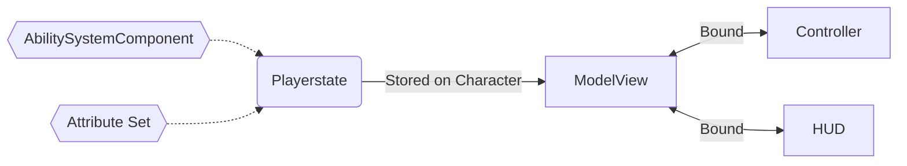

```mermaid
    flowchart LR
    A(Playerstate)
    C[ModelView]
    D[Controller]
    G[HUD]


    E{{AbilitySystemComponent}}
    F{{Attribute Set}}

    E -.-> A
    F -.-> A
    A --> |Stored on Character| C
    C <--> |Bound| D
    C <--> |Bound| G

```